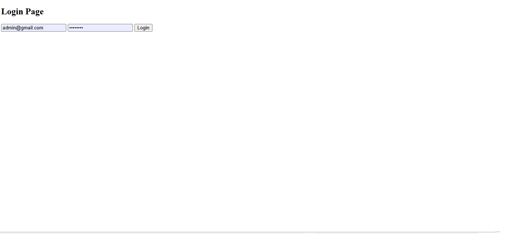
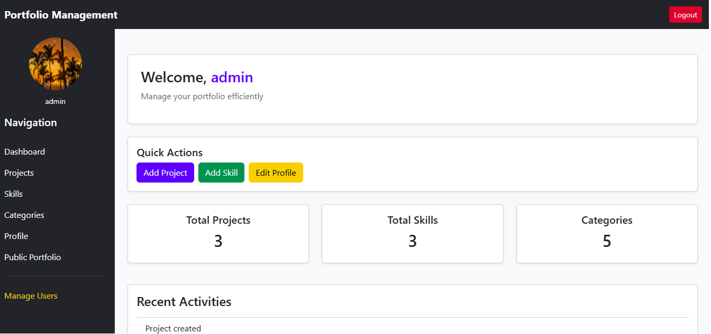
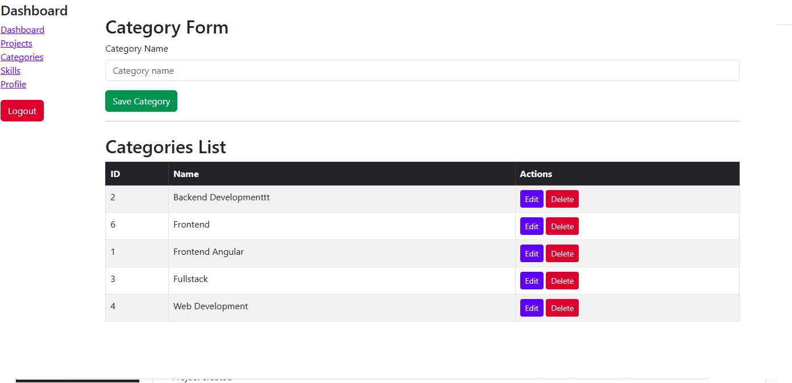
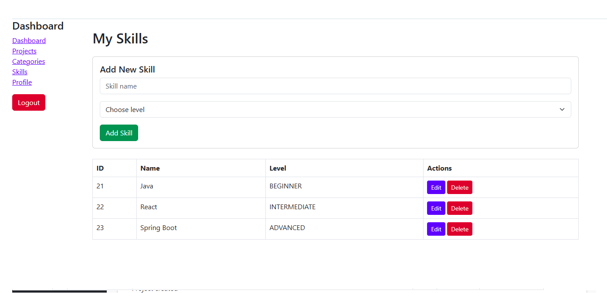
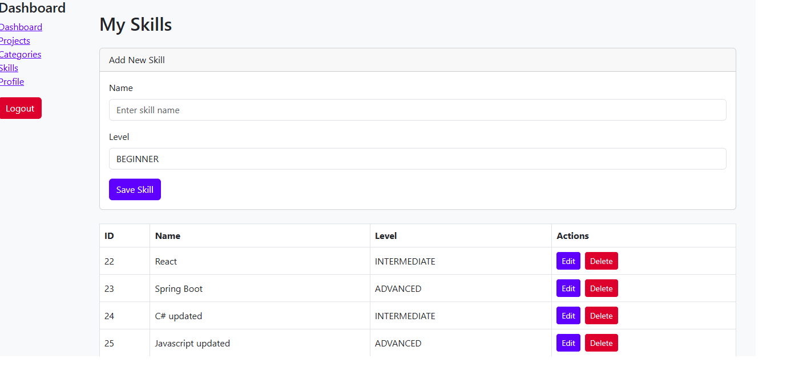

## Portfolio Management System

A web application built with **Java Spring Boot, Thymeleaf, Spring Security, Hibernate and MySQL** for managing portfolio projects.

The application allows administrators to manage projects, skills, categories and users. Users can create accounts, manage their profiles, upload profile images and interact with portfolio content.

---

# Features

## Authentication

- User registration
- Login and logout
- Password encryption
- Role-based access control (ADMIN / USER)
- Protected admin actions using Spring Security

---

## Security

The application includes:

- BCrypt password encryption
- Role-based authorization
- Protected admin routes
- Session management
- Ownership validation for user resources
- Input validation
- Error handling and user feedback

---

## Dashboard

- Project statistics
- Skills statistics
- Categories statistics
- Recent activity tracking
- User activity logging
- Notifications section
- Role-based dashboard display

---

## Projects

- Create projects
- Edit projects
- Delete projects
- Upload project images
- Assign skills and categories
- Search projects
- Filter projects by category
- Manage portfolio content

---

## Skills & Categories

- Add skills
- Edit skills
- Delete skills
- Add categories
- Edit categories
- Delete categories
- Connect skills and categories with projects

---

## Profile Management

- View profile information
- Update profile details
- Upload profile image
- Change password
- Validate required fields

---

# User Roles

## USER

Users can:

- Create an account
- Login securely
- View dashboard
- Manage profile information
- Upload profile images
- View projects, skills and categories
- Access public portfolio pages


## ADMIN

Administrators can:

- Manage users
- Manage projects
- Create, update and delete skills
- Create, update and delete categories
- Perform administrative actions
- Manage portfolio content

---

# Main Endpoints


## Authentication

```
GET  /login

GET  /register

POST /register
```

---

## Dashboard

```
GET /

GET /dashboard
```

---

## Projects

```
GET  /projects

GET  /projects/create

POST /projects

GET  /projects/edit/{id}

POST /projects/update/{id}

POST /projects/delete/{id}

GET  /projects/categorize/{id}

POST /projects/categorize/{id}
```

---

## Skills

```
GET  /skills

GET  /skills/create

POST /skills/save

GET  /skills/edit/{id}

POST /skills/update

POST /skills/delete/{id}
```

---

## Categories

```
GET  /categories

POST /categories/save

GET  /categories/edit/{id}

GET  /categories/delete/{id}
```

---

## Profile

```
GET  /profile

GET  /profile/edit

POST /profile/update

POST /profile/upload-image

GET  /profile/change-password

POST /profile/change-password
```

---

## Public Portfolio

```
GET /portofolio

GET /portofolio/project/{id}
```

---

## Admin

```
GET /admin/users
```

(Admin access required)

---

# Technologies


## Backend

- Java 17
- Spring Boot
- Spring MVC
- Spring Security
- Spring Data JPA
- Hibernate


## Frontend

- Thymeleaf
- HTML
- CSS
- Bootstrap


## Database

- MySQL


## Deployment

- Render

---

# Project Structure

```
src/main/java/com/alba/portfolio

├── controller
├── service
├── repository
├── entity
├── dto
└── security
```

The project follows MVC architecture:

```
Controller

      ↓

Service

      ↓

Repository

      ↓

Database
```

---

# Installation


## Requirements

- Java 17+
- Maven
- MySQL


---

## Clone Repository

```bash
git clone repository-url
```

---

# Database Configuration

Create a MySQL database and update:

```
application.properties
```

Example:

```properties
spring.datasource.url=jdbc:mysql://localhost:3306/portfolio_db
spring.datasource.username=root
spring.datasource.password=your_password

spring.jpa.hibernate.ddl-auto=update
```

---

# Run Application

Using Maven:

```bash
mvn spring-boot:run
```

Open browser:

```
http://localhost:8080
```

---

# Deployment

The application is deployed using **Render**.

Deployment includes:

- Spring Boot application
- MySQL database connection
- Environment variable configuration


Required environment variables:

```
DB_URL

DB_USERNAME

DB_PASSWORD
```


Example:

```
DB_URL=database_url

DB_USERNAME=username

DB_PASSWORD=password
```

---

# Image Upload

The application supports:

- Project images
- Profile images


Images are currently stored locally.

For production scalability, cloud storage integration can be added in the future.

---

# Screenshots


## Login Page




## Dashboard




## Projects


## Categories




## Profile


## Admin Skills




## Public Portfolio



---

# Testing

The application was tested through functional, validation, security and UI testing.


Completed:

✅ Registration testing  
✅ Login testing  
✅ Authentication testing  
✅ Dashboard testing  
✅ Profile management testing  
✅ Image upload testing  
✅ Skills CRUD testing  
✅ Categories CRUD testing  
✅ Projects CRUD testing  
✅ Search testing  
✅ Filtering testing  
✅ Authorization testing  
✅ Validation testing  
✅ Error handling testing  
✅ Navigation testing  
✅ UI testing  
✅ Security testing  
✅ Deployment testing


---

# Author

Alba

Spring Boot Junior Developer