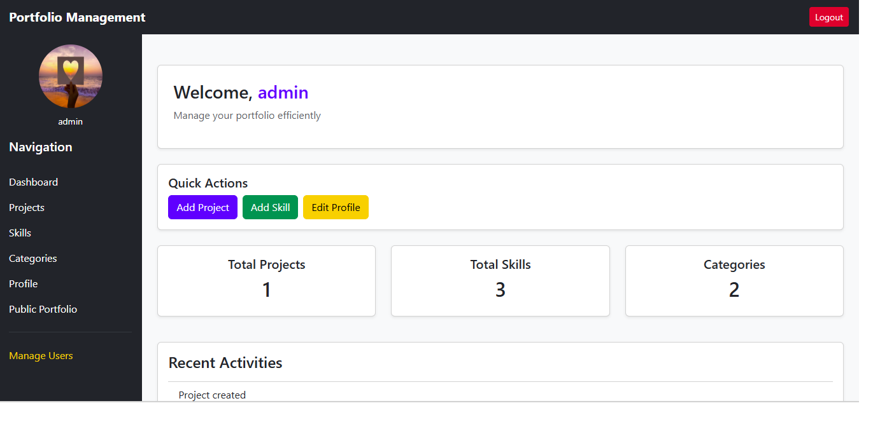
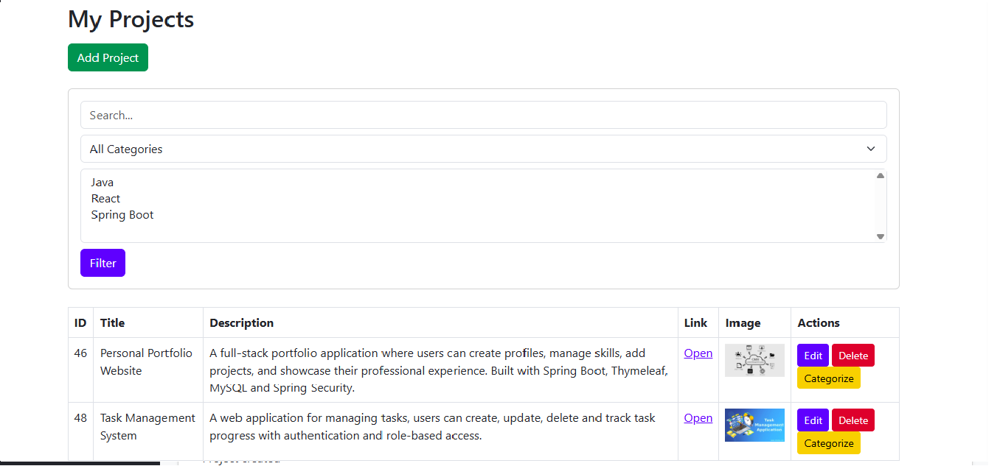
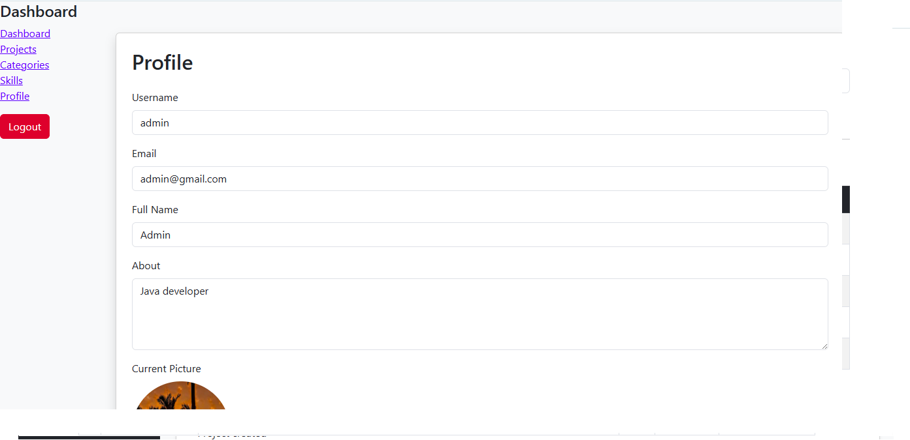

# Portfolio Management System

A web application built with **Java Spring Boot, Thymeleaf, Spring Security, Hibernate and MySQL** for managing portfolio projects.

The application allows administrators to manage projects, skills, categories and users. Users can create accounts, update their profiles, change passwords and upload profile images.

---

## Features

### Authentication
- User registration
- Login and logout
- Password encryption
- Role-based access (ADMIN / USER)
- Protected admin actions with Spring Security

### Dashboard
- Project statistics
- Skills statistics
- Categories statistics
- Recent activity tracking
- Notifications

### Projects
- Create, edit and delete projects
- Upload project images
- Assign skills and categories
- Search projects
- Filter projects

### Skills & Categories
- Add, edit and delete skills
- Add, edit and delete categories
- Connect skills and categories with projects

### Profile
- View profile
- Update profile information
- Upload profile image
- Change password

---

# Main Endpoints

## Authentication

```
GET  /login

GET  /register

POST /register
```

---

## Dashboard

```
GET /

GET /dashboard
```

---

## Projects

```
GET  /projects

GET  /projects/create

POST /projects

GET  /projects/edit/{id}

POST /projects/update/{id}

POST /projects/delete/{id}

GET  /projects/categorize/{id}

POST /projects/categorize/{id}
```

---

## Skills

```
GET  /skills

POST /skills/save

GET  /skills/edit/{id}

POST /skills/update

POST /skills/delete/{id}
```

---

## Categories

```
GET  /categories

POST /categories/save

GET  /categories/edit/{id}

GET  /categories/delete/{id}
```

---

## Profile

```
GET  /profile

GET  /profile/edit

POST /profile/update

POST /profile/upload-image

GET  /profile/change-password

POST /profile/change-password
```

---

## Portfolio Preview

```
GET /portofolio

GET /portofolio/project/{id}
```

---

## Admin

```
GET /admin/users
```

(Admin access required)

---

# Technologies

## Backend
- Java 17
- Spring Boot
- Spring MVC
- Spring Security
- Spring Data JPA
- Hibernate

## Frontend
- Thymeleaf
- HTML
- CSS
- Bootstrap

## Database
- MySQL

## Deployment
- Render

---

# Project Structure

```
src/main/java/com/alba/portfolio

├── controller
├── service
├── repository
├── entity
├── dto
└── security
```

The project follows MVC architecture:

```
Controller

    ↓

Service

    ↓

Repository

    ↓

Database
```

---

# Installation

## Requirements

- Java 17+
- Maven
- MySQL

---

## Clone Repository

```bash
git clone repository-url
```

---

## Database Configuration

Create a MySQL database and update:

```
application.properties
```

Example:

```properties
spring.datasource.url=jdbc:mysql://localhost:3306/portfolio_db
spring.datasource.username=root
spring.datasource.password=your_password

spring.jpa.hibernate.ddl-auto=update
```

---

## Run Application

Using Maven:

```bash
mvn spring-boot:run
```

Open in browser:

```
http://localhost:8080
```

---

# Deployment

The application is deployed using **Render**.

Deployment includes:

- Spring Boot application
- MySQL database connection
- Environment variable configuration

Required environment variables:

```
DB_URL
DB_USERNAME
DB_PASSWORD
```

Example:

```
DB_URL=database_url
DB_USERNAME=username
DB_PASSWORD=password
```

After deployment, the application can be accessed through the Render URL.

---

# Image Upload

The application supports:

- Project images
- Profile images

Images are stored locally in:

```
uploads/
```

For production environments, cloud storage can be added in the future.

---

# Screenshots
## Screenshots

### Login


### Dashboard


### Projects


### Skills


### Categories


### Profile


# Testing

Completed:

✅ Authentication  
✅ CRUD operations  
✅ Dashboard  
✅ Search and filters  
✅ Image upload  
✅ Profile management  
✅ Password change  
✅ Deployment

---

# Author

Alba

Spring Boot Junior Developer